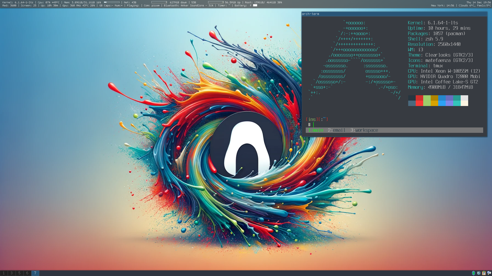
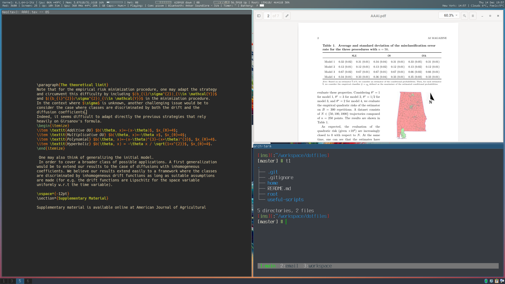

## Dava's Dotfiles

Welcome to my dotfiles! Here I maintain my custom configuration for my Arch Linux setup.

Here you'll find:  

* **Basic, Yet Efficient Setups:** I tend to stick with most of the configuration as-is, with
  minimal changes. It's pretty basic, but that's exactly how I like it. Clean, straightforward, and
  efficient.
* **Perfect for Beginners:** If you're just starting with Arch Linux, you might find my
  configurations super helpful. They're easy to understand and implement, making your journey into
  the world of Arch a bit smoother.

Feel free to explore, use, and modify anything you find here.

Happy configuring!

## Screenshots

## Configs

| Shell               | WM / DE                       | Editor                                     | Terminal                                                      | Multiplexer                                   | Mail                            | IRC                         |
| -----------         | -----------                   | -----------                                | -----------                                                   | -----------                                   | -----------                     | -----------                 |
| [Zsh](./home/zshrc) | [i3](./home/config/i3/config) | [Neovim](./home/config/nvim-lazy/init.lua) | [rxvt-unicode](./home/Xresources)                             | [tmux](./home/tmux.conf)                      | [neomutt](https://neomutt.org/) | [irssi](https://irssi.org/) |

## How to setup the repository

There are many ways to manage your dotfiles. I personally just symlink my dotfiles using my own
script but you can use other better alternatives for this.

Other ways to manage dotfiles:  

* [bare git repo](https://developer.atlassian.com/blog/2016/02/best-way-to-store-dotfiles-git-bare-repo/)
* [utilities](https://dotfiles.github.io/utilities/)

